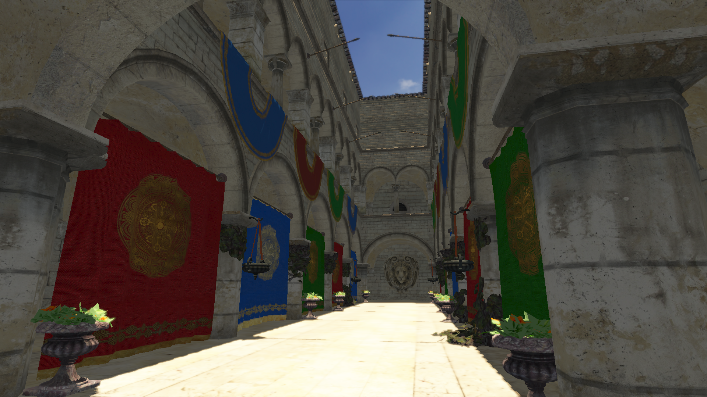

# Sponza Scene

This project implements a renderer using OpenGL and C++. 



## Overview

The program loads the model as a [gLTF]. The model contains a few
different types of textures, of which the renderer currently makes use of the
diffuse and normal textures.
In addition to the Sponza model there is also a skybox implemented using cubemaps.

The meshes and textures are fed through a series of different rendering passes:

1. **Shadow Map:** The scene contains a directional light providing sun
and atmospheric lighting. In order for the sun to cast shadows a 1024x1024 pixel depth map
is rendered from the perspective of the directional light. The light uses orthographic
projection to transform and render the scene.

2. **Geometry:** Next, the scene gets rendered from the perspective of the camera,
which can move freely through the scene. In this stage the meshes and textures are rendered
without lighting into a geometry buffer that contains an attachment for albedo, one for
world positions of the fragments, one for normals and a depth attachment.

3. **Lighting:** After creating the geometry buffer, it is passed through a shader
that calculates the appropriate lighting based on the lights in the scene. Currently, this is
limited  to the one directional light. The shadow map generated earlier is also used in this pass.
The shader used in this pass applies the [Blinn-Phong] lighting model. This model isn't super realistic
and currently only takes diffuse and normal maps into account but still looks quite nice.
I hope to implement PBR soon.

4. **Post-processing:** The steps taken so far use HDR and the linear color space, so this step
is primarily responsible for tone-mapping the HDR colors into SDR colors and applying gamma
correction. However, the post-processing step also applies a bloom effect. For this to work
the lighting pass also generated a texture containing just the bright parts of the image which
are then blurred by applying a gaussian blur multiple times using [ping-pong] frame buffers, which
alternate between horizontal and vertical blurring, which increases performance at the cost
of some memory overhead.

5. **UI:** This pass isn't strictly part of the render, but once the actual scene has been rendered
[Dear ImGUI] is used to generate a basic user interface to change some of the settings used to render 
the scene, such as light colors and strengths, gamma correction, and more.

As evident by the render passes this renderer uses deferred shading instead of forward shading.
This could be considered over-kill for such a simple scene with a single light source, but allows
implementing many other screen-space effects in the future, such as SSAO. And of course this is a
learning project, so using a simple forward renderer would be boring!

[gLTF]: https://www.khronos.org/gltf/
[Assimp]: https://www.assimp.org/
[Blinn-Phong]: https://en.wikipedia.org/wiki/Blinn%E2%80%93Phong_reflection_model
[ping-pong]: https://en.wikipedia.org/wiki/Ping-pong_scheme
[Dear ImGUI]: https://github.com/ocornut/imgui

## Controls

The camera can be move through the scene using the WASD keys to move forward, backward,
left and right. While holding the right mouse button the mouse can be moved around to 
look around in the scene. The space bar and left CTRL key can be used to move up and down 
as well.

## Build instructions

This project uses [CMake] as a build tool and [vcpkg] for dependency management.
Vcpkg is included as a git submodule, as such you should execute `git submodule update --init --recursive`
in the project directory to ensure everything is ready. CMake will automatically
invoke vcpkg to download and install the required dependencies. This can take a while
the first time.
By default [Ninja] is configured as the build system, so that will need to be install as well.

You might need to install additional system dependencies to be able to compile the project.
On Ubuntu `libxinerama-dev libxcursor-dev xorg-dev libglu1-mesa-dev pkg-config` are required.

To build the project the following commands can be used:
```
$ mkdir build
$ cmake --preset Debug -B build
$ cd build
$ cmake --build .
```
These commands should work on Linux and Windows.

Do note that downloading and building the dependencies can take a while. Especially [Assimp]
sadly takes quite a while to compile because it is a big library.

The resulting binary can be found under `build/Debug/sponza_scene(.exe)`. Make sure to run the 
program from the project's root directory, because the assets are loaded from `[cwd]/assets`.
I.e. run `./build/Debug/sponza_scene(.exe)` in the project's root directory.

[CMake]: https://cmake.org/
[vcpkg]: https://vcpkg.io/en/cmake
[Ninja]: https://ninja-build.org/

## Credits
 - Sponza model: https://github.com/KhronosGroup/glTF-Sample-Assets/tree/main/Models/Sponza
 - Skybox: https://polyhaven.com/a/kloofendal_48d_partly_cloudy_puresky
